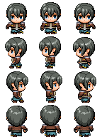
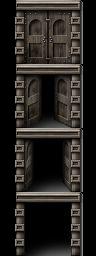

# 게임 이름

 ### Endure the Five deadly sins(5개의 욕망 참기)

## 개발 엔진

 유니티

## 게임 장르

 싱글 플레이어, 쯔꾸르, 미로, 퍼즐, 퀴즈

## 기획 의도

 개인적으로 7대 죄악 컨셉을 굉장히 좋아해서 해당 컨셉과 관련된 게임을 만들어 보고 싶었는데 이번 학기 수업을 이 컨셉으로 만들어 보자라는 생각을 하게 되어서 만들게 되었습니다.

## 플레이 방식

방향키만 이용한 방식의 미니 게임들을 클리어 해 나가면서 미로 탈출하기

## 주인공 캐릭터
### 주인공 캐릭터는 RPG Maker MV라는 프로그램에서 최대한 평범한 캐릭터로 만들어서 가져왔습니다.

1.  앞 모습
2.  옆 모습 1
3.  옆 모습 2
4.  뒷 모습
5.  걷기 애니메이션을 위한 전체 모습

## 그외 이미지들

### 문
 원본  편집본(인 게임 사용)

 
### 참고 하고 있는 영상

유튜버 [케이디님][케이디], [골든메탈님][골든메탈], [Dev GomDol님][곰돌]

[케이디]: https://www.youtube.com/c/%EC%BC%80%EC%9D%B4%EB%94%94
[골든메탈]: https://www.youtube.com/c/GoldMetal
[곰돌]: https://www.youtube.com/c/DevGomDol/videos
